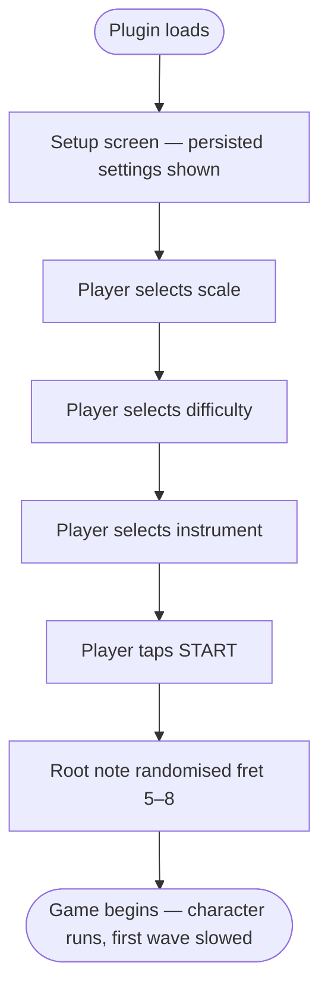
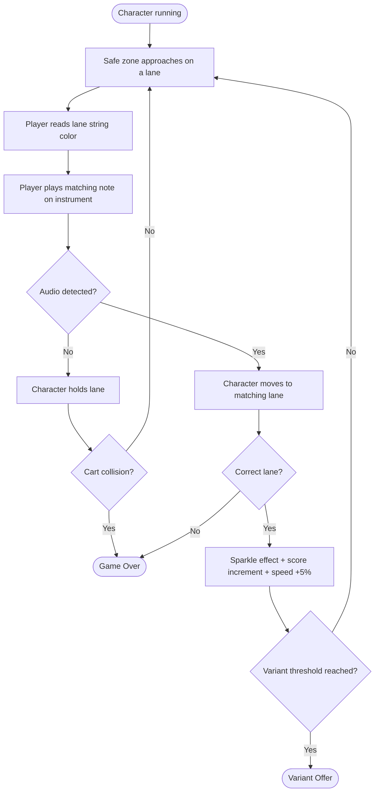
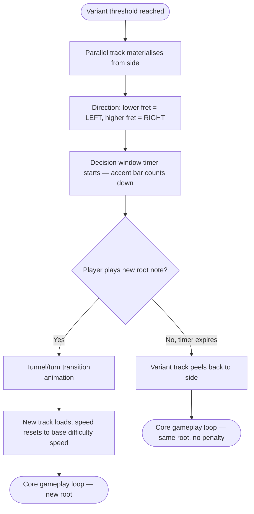
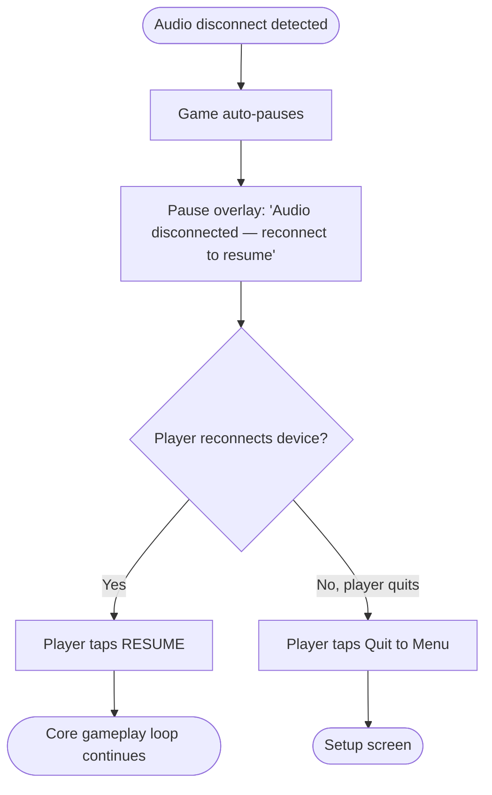
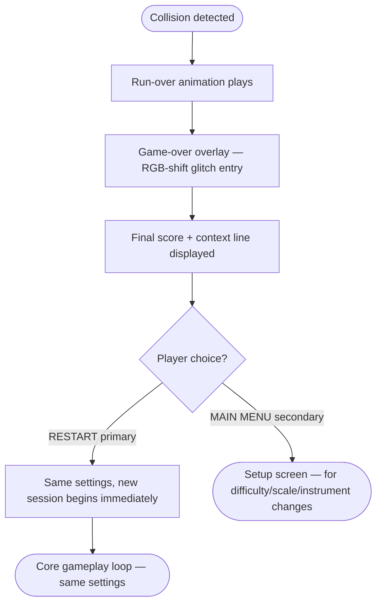

# UX Design Specification — Subway Scaler

**Author:** OmikronApex
**Date:** 2026-05-20

---

<!-- UX design content will be appended sequentially through collaborative workflow steps -->

## Executive Summary

### Project Vision

Subway Scaler is a Subway Surfers-style guitar and bass scale trainer embedded as a Slopsmith plugin. Players physically perform scales on their instrument while a scrolling 3D track presents note targets as safe zones — correct notes advance the character, collisions end the session. The game teaches scale patterns and neck position through repetition and play, not theory lectures.

The visual identity is a **PS1 demake aesthetic** — low-poly 3D geometry, limited color palettes, chunky UI elements — while maintaining unambiguous readability for all gameplay-critical elements (safe zones, carts, score, text).

### Target Users

Intermediate hobbyist guitarists and bassists who are physically at their instrument while playing — attention is split between screen and hands. May be familiar with Rocksmith's string color conventions.

### String Color System

Matches Rocksmith's convention:

| String position | Color |
|---|---|
| Lowest | Red |
| 2nd | Yellow |
| 3rd | Blue |
| 4th | Orange |
| 5th | Green |
| 6th | Purple |
| 7th (7-string only) | Pink |

- **4-string bass:** Red → Yellow → Blue → Orange
- **5-string bass:** Red → Yellow → Blue → Orange → Green
- **6-string guitar:** Red → Yellow → Blue → Orange → Green → Purple
- **7-string guitar:** Red → Yellow → Blue → Orange → Green → Purple → Pink

### Session Setup Persistence

Last-used scale, root, difficulty, and instrument persist as defaults.

### Key Design Challenges

1. **Split attention** — gameplay-critical visuals must be readable at a peripheral glance. No important information requires focused reading mid-session.
2. **Detection feedback legibility** — correct note hit signal must be immediate and unambiguous at 60fps inside a moving, retro-styled scene.
3. **Fixed-ratio responsive viewport** — plugin lives in a resizable Slopsmith window. A 16:9 game shell scales to fit available height, centred horizontally. Canvas and all overlays are anchored to the shell — no hardcoded dimensions, no stretching at extreme viewport shapes.
4. **Aesthetic vs. readability tension** — PS1 demake style applies to background, secondary geometry, and decoration. Gameplay elements (safe zones, carts, score, text) are always legibility-first.
5. **Overlay design** — pause and game-over states must interrupt cleanly with single-action affordances (Resume, Restart).

### Design Opportunities

1. **Rocksmith familiarity** — players recognize the string color system immediately, reducing track visualization learning curve to near zero.

2. **PS1 demake as identity** — a specific, committed aesthetic gives Subway Scaler a personality that's distinctive and shareable.

3. **Educational layer in visuals** — track lanes can passively show note names or fret numbers without dedicated UI space.

4. **Variant switching as a first-class game moment (FR-008)** — parallel track system with two outcomes:

   - **Ignored:** variant track appears alongside current tracks (breather window), then peels away — game continues on current root
   - **Accepted:** player hits the new root note during the window → tunnel/turn transition → new fret track loads, speed resets to base difficulty speed

   Speed reset is the mechanical incentive — variant cycling becomes viable and rewarding at any difficulty. The transition window length is tunable. A visible speed-drop cue confirms the reward landed.

5. **Difficulty ramp as game feel** — acceleration curve designed to create a recognizable "in the zone" sensation, not a wall.

---

## Core User Experience

### Defining Experience

The core interaction of Subway Scaler is: **play a note → the game responds.** Not a click, not a keypress — a physically played note, detected in real time, translated into movement with no perceptible latency. What you play is what you mean. The game makes no distinction between intentional and accidental; it responds honestly to every note.

### Platform Strategy

- **Platform:** Web browser, self-hosted. Desktop and tablet browsers supported. Mobile phones out of scope.
- **Offline capability:** No external internet dependencies after install. All third-party assets vendored locally (Three.js at `static/game/vendor/`). Local network calls to Slopsmith and other plugins are acceptable.
- **Input:** Mouse and touch for all UI. Gameplay input is audio-only — no pointer interaction during active play.
- **Viewport behavior:** The plugin is rendered as a normal `display: block` element inside Slopsmith's page flow. The root applies `padding-top: 4rem` to clear Slopsmith's fixed navbar (`h-16` = 64 px). Inside the root, a single **game shell** div maintains a fixed **16:9 aspect ratio**, is height-driven (`height: calc(100vh - 4rem)`), and is centred horizontally — never stretched. Dead space beside the shell at wide viewports is filled with `color-bg-void`. No scrolling in the game view. All touch targets minimum ~44×44px. No hover-only states.

### Effortless Interactions

| Interaction | Target feel |
|---|---|
| Starting a session | Persisted settings + one confirm → playing in under 5 seconds |
| Note → character movement | Instantaneous. Any lag is a broken experience. |
| Variant acceptance | Playing the root note IS the input. Accidental or intentional — both count. |
| Restarting after game over | One click. Same settings. Back to IDLE immediately. |
| Audio disconnect recovery | Auto-pause. Single "Resume" click when ready. |

### Critical Success Moments

1. **First response** — detected note moves the character within the first 5 seconds. *The game is listening to me.*
2. **First clean run** — character survives a full wave without collision.
3. **First variant transition** — intentional or accidental, speed resets, reads as a power-up.
4. **The zone** — speed has ramped, notes flow without conscious thought.
5. **Score milestone** — visible climbing score sustains "one more run."

### Experience Principles

1. **Sound before sight** — the instrument is the controller. Every gameplay-meaningful interaction is triggered by playing. What you play is what you mean — the game responds to every note without judging intent.

2. **Glance-readable** — both hands are on the instrument at 60fps. Position, color, and spatial distance carry information. Text and fine detail do not. Design for peripheral vision, not focused reading.

3. **The screen is the fretboard** — track layout spatially maps to the guitar neck. Every lane is labeled with its fret number. The distance between track sets equals the physical hand movement distance. Reading the screen and reading the fretboard are the same act.

4. **Difficulty scales the player, variants challenge the expert** — difficulty settings (speed, time windows) target different skill levels. Variants are optional: new players discover neck shifting gradually, experienced players test position-shift muscle memory under pressure. No player is blocked or overwhelmed.

5. **Feedback is honest and immediate** — audio-to-visual response is instantaneous. Latency is a trust contract. Hits are confirmed unambiguously. Misses are clear. The game never lies about what it heard.

6. **Silence is never ambiguous** — audio errors (device disconnect, failed detection) are communicated clearly and briefly without breaking flow. The game always tells you if it can't hear you.

7. **The game gets out of the way** — session setup is fast. Theory is ambient: fret labels are spatially readable, not analytically demanding. Overlays are minimal and single-action. Between the plugin opening and the player playing, the distance is as short as possible.

8. **Retro soul, modern standards** — PS1 aesthetic applies to geometry, palette, and decoration. Latency, responsiveness, frame rate, and clarity are held to contemporary standards. When aesthetic and readability conflict, readability wins.

---

## Desired Emotional Response

### Primary Emotional Goals

| Emotion | What creates it |
|---|---|
| **Flow** | Speed ramp + audio-only input = nothing breaks the playing state |
| **Accomplishment** | Visible score, clean runs, variant transitions — small wins stack |
| **Playful challenge** | PS1 demake aesthetic signals "this is a game, not a lesson" |
| **Confidence** | Honest, immediate feedback — the game never lies about what it heard |

### Emotional Journey Mapping

| Moment | Target emotion | Design lever |
|---|---|---|
| Plugin opens | Curious, settled quickly | Persisted settings — no decision paralysis |
| First note detected | Surprise → delight | Instant character response within 5 seconds |
| First collision | Brief sting → determination | One-click restart, same settings, no friction |
| Speed ramping | Focus → exhilaration | Smooth acceleration curve, no sudden walls |
| Variant appears | Intrigue, agency | Parallel track gives breathing room, no panic |
| Variant accepted | Pride / happy surprise | Speed reset reads as power-up, not penalty |
| Session end | Accomplished, wanting more | Score visible throughout, "one more run" pull |
| Audio disconnect | Calm, not panicked | Auto-pause, clear message, single Resume action |

### Micro-Emotions

**Cultivate:**
- **Confidence over confusion** — fret labels, string colors, and spatial mapping mean the player always knows what they're looking at
- **Trust over skepticism** — zero-lag feedback earns trust in the first 10 seconds; players stop doubting the detection and start trusting their own playing
- **Delight over mere satisfaction** — variant transitions (especially accidental ones), sparkle/glow effects, and the speed reset are surprise moments that exceed expectation
- **Accomplishment over grind** — every clean wave is a small win; the score makes progress visible

**Avoid:**
- **Anxiety** — variants are optional, difficulty is chosen, failure is never permanent
- **Disconnection from the music** — the diegetic fretboard design keeps the game world and the real instrument in the same mental space
- **Punishing frustration** — no multi-step restart flows, no "you lost all progress" screens, no loading between attempts

### Design Implications

- **Flow → no interruptions:** overlays are single-action, session setup is seconds, the variant window is a breather not a crisis
- **Delight → deliberate surprise moments:** the tunnel/turn variant transition animation, sparkle on correct notes, and the visible speed-drop cue after a variant switch are designed as micro-celebrations
- **Confidence → honest UI:** fret labels always visible, detection state communicated clearly (silence is never ambiguous), hit/miss feedback immediate and unambiguous
- **Playfulness → aesthetic commitment:** the PS1 demake style signals "fun" before a note is played; it sets emotional permission to experiment and fail without consequence
- **Trust → latency as a first-class concern:** the emotional contract is broken the moment the character lags behind the note; this is a UX requirement, not just a technical one

### Emotional Design Principles

1. **Earn trust in the first 10 seconds** — the first detected note moving the character instantly is the single most important emotional moment in the product.
2. **Failure is a comma, not a period** — game over is a one-click reset. The emotional cost of failure is kept deliberately low.
3. **Surprise is a feature** — accidental variant transitions, lucky hits, speed milestones — design to occasionally exceed expectation, not just meet it.
4. **The game world and the fretboard are the same world** — diegetic design keeps the player emotionally present in both simultaneously, not context-switching between a screen and an instrument.

---

## UX Pattern Analysis & Inspiration

### Inspiring Products Analysis

**Rocksmith (Ubisoft)**

The foundational reference for fretboard-to-screen translation. Key UX successes:
- String color coding creates an immediate visual language players internalize within minutes — borrowed directly
- The "note highway" maps the fretboard into a scrolling 2D space, making abstract music theory physically legible
- Real-time detection feedback (note lights up on hit) closes the loop between physical action and visual reward instantly
- Difficulty tiers let players choose their challenge level without gating content

UX weaknesses to learn from:
- Screen becomes visually cluttered at higher difficulties — too many simultaneous information layers
- HUD elements (tone, tuner, score) compete with the highway for attention
- Session setup requires multiple navigation steps before play begins

**Subway Surfers (Kiloo)**

The gameplay loop template. Key UX successes:
- Single-input endless runner: one action drives all gameplay — maximum accessibility, minimum barrier to entry
- Lane-based structure gives the player a clear spatial grammar
- Obstacle telegraphing: obstacles visually prominent with enough lead time to react
- One-tap restart: game over → playing again in under 2 seconds, zero friction
- Score always visible without interrupting gameplay
- Speed escalation is smooth — players don't notice the ramp until they're deep in it

**PS1 Aesthetic References (Crash Bandicoot, Spyro, Tony Hawk's Pro Skater)**

- **Crash Bandicoot:** Bold, high-contrast level design with clear visual hierarchy despite polygon limits. Obstacles readable from distance. UI minimal, chunky, peripheral.
- **Tony Hawk's Pro Skater:** Score multiplier always visible top-corner. Combo system gives in-session feedback without pausing action. Simple fill bar for special meter — glanceable.
- **General PS1 palette:** Limited colors force deliberate contrast. Every UI element earns its color. Readability emerges from constraint, not addition.

### Transferable UX Patterns

**Adopt directly:**
- Rocksmith string color system — already in spec
- Subway Surfers one-tap restart — game over → playing in one action, same settings
- Subway Surfers obstacle telegraphing — carts visible far enough in advance to react at max speed
- Tony Hawk score visibility — score always in corner, never interrupts play
- PS1 high-contrast UI — chunky text, strong outlines, limited palette reads at a glance

**Adapt:**
- Rocksmith note highway → 3D Subway-style lane system: lanes = strings, scroll = time, fret labels replace note names
- Subway Surfers lane switching → audio-driven character position: playing a note moves the character, no swipe needed
- Tony Hawk special meter → speed/difficulty indicator: peripheral fill bar showing current speed multiplier, glanceable without reading
- Crash Bandicoot level clarity → variant track design: parallel track reads as distinct (shimmering, different tone) without adding visual noise

**Avoid:**
- Rocksmith information density: no HUD elements competing with the track during play. Score and speed only.
- Guitar Hero note-reading paradigm: Subway Scaler is not a reading game. The track confirms and rewards; it doesn't instruct in real time.
- Any pattern requiring precise touch interaction during gameplay — both hands are on the instrument.

### Anti-Patterns to Avoid

- **Session cold start** — settings reset each session. Subway Scaler persists everything.
- **Information overload during play** — one active HUD area (score + speed), everything else is track geometry.
- **Punishing restart flows** — no loading screens or menu navigation after game over. One action, immediate return.
- **Hover-state-only affordances** — tablet players won't discover them. Every element works on tap without hover.
- **Stretch-to-fill at arbitrary aspect ratios** — game shell locks to 16:9 and letterboxes; it never distorts.

### Design Inspiration Strategy

**Adopt:**
- Rocksmith string colors (already in spec)
- Subway Surfers one-tap restart and obstacle telegraphing
- PS1 high-contrast, chunky, minimal UI language
- Tony Hawk always-visible peripheral score

**Adapt:**
- Rocksmith highway → 3D Subway-style lane system with fret numbers as geometry labels
- Subway Surfers lane switching → audio-driven character position
- Variant track = distinct visual treatment (shimmering/colored border) readable at glance without demanding focus

**Avoid:**
- Rocksmith HUD density
- Guitar Hero note-reading paradigm
- Touch-hostile or fixed-viewport patterns

---

## Design System Foundation

### Design System Choice

Custom minimal token system — no third-party component library. Single source of truth: `static/game/ui/tokens.js` defines the full palette as JS constants, derives CSS hex strings from them, and injects CSS custom properties at app init. No separate `tokens.css` file — eliminates sync drift risk without requiring a build pipeline.

### Rationale

- Three.js canvas renders ~95% of visual content; HTML overlays are 3 screens only (setup, pause, game-over)
- No bundler in the stack — CDN-delivered libraries violate the offline-after-install requirement; npm-delivered ones require a build step
- PS1 demake aesthetic requires full visual ownership — a library with strong default opinions would fight it
- Single-source-of-truth (`tokens.js`) eliminates CSS/JS color drift with zero tooling overhead
- Token vocabulary deliberately constrained — only token what crosses the layer boundary or gameplay depends on

### Implementation Approach

`tokens.js` is the single source of truth. It exports JS hex constants (used directly by Three.js materials) and derives CSS hex strings injected as custom properties at app init. All HTML overlays consume those custom properties via standard CSS `var()`.

```
static/game/ui/
├── tokens.js        — Single source: JS constants + derives CSS values, injects at init
├── setup.css        — Session setup screen styles
└── overlays.css     — Pause + game-over overlay styles
```

Init pattern:

```js
// tokens.js
export const STRING_COLORS = { 1: 0xFF3333, 2: 0xFFDD00, 3: 0x3366FF, 4: 0xFF8800, 5: 0x33AA33, 6: 0x9933CC, 7: 0xFF66AA };

const _toCss = v => `#${v.toString(16).padStart(6, '0')}`;

export function injectTokens() {
  const root = document.documentElement;
  Object.entries(STRING_COLORS).forEach(([k, v]) =>
    root.style.setProperty(`--color-string-${k}`, _toCss(v))
  );
  // additional tokens injected here
}
```

A single locally-vendored chunky pixel or monospace font covers both CSS (`@font-face`) and Three.js canvas textures.

### Token Vocabulary

**Token what crosses the layer boundary or gameplay depends on:**

| Token | Description |
|---|---|
| `color-string-{1–7}` | Rocksmith string colors, named by purpose (`color-string-1`, not `color-red`) |
| `color-bg-void` | Deepest background depth — sky/void |
| `color-bg-stage` | Mid depth — surface/stage |
| `color-bg-near` | Near-ground (optional third depth level) |
| `color-accent` | Single "interact with this / scoring you" color — one only |
| `color-text-primary` | Primary readable text |
| `color-text-disabled` | Inactive/disabled state |
| `color-edge` | Hard outline for chunky PS1 silhouettes |
| `transition-overlay` | Overlay entry/exit duration — the motion grammar anchor |

**Overlay Motion Grammar:** All HTML overlays use a single documented entry/exit pattern (e.g., scan-line, hard-cut, or signal-noise bleed), controlled by `transition-overlay`. Pause and game-over overlays share this pattern — consistency signals they belong to the same world. The specific pattern is a visual design decision; the token ensures it never diverges between screens.

**Deliberately excluded:**

| Category | Reason |
|---|---|
| Spacing/sizing scale | Three.js doesn't consume it; the HTML layer has 3 screens — define layout directly |
| Typography scale | One font, one weight. Tokens imply choosing from options; there are none. |
| Opacity values | PS1 aesthetic rejects translucency — reaching for opacity signals the wrong visual language |
| Semantic color aliases (`danger`, `success`, `warning`) | Web app thinking. Game semantics are: string color, accent, text. Nothing else. |

### Customization Strategy

Total token count: ~15 values. PS1 palette constraint is enforced by design — the vocabulary above is the ceiling, not a starting point. Gameplay-critical elements (safe zones, carts, score, text) always use maximum contrast; no aesthetic treatment at the cost of legibility. Decorative PS1 treatment (low-poly geometry, chunky outlines, dithered backgrounds) lives in Three.js scene objects only. Touch targets minimum 44×44px enforced directly in `overlays.css`.

---

## Core Experience Definition

### Defining Experience

"Play a note, the game responds." Every other interaction is secondary.

The player's instrument is the sole gameplay controller. A physically played note, detected in real time, translates to character movement with no perceptible latency. There are no swipes, clicks, or button presses during active play. The game makes no distinction between intentional and accidental; it responds honestly to every note.

This is the trust contract: if the character moves when you play, the game works. If it lags, the game is broken. Latency is not a performance concern — it is the defining UX concern.

### User Mental Model

Players arrive with mental models from two sources:

**From Rocksmith:** A scrolling note highway maps to the fretboard. String colors are a visual language they already speak. Notes light up when hit. The screen is a mirror of the instrument.

**From Subway Surfers / endless runners:** Lanes represent positions. Obstacles must be avoided. One action moves between lanes. Speed escalates. The goal is survival, not completion.

**The new model Subway Scaler introduces:** The physical act of playing a note IS the lane input. There is no intermediary gesture. The hand moves on the neck — the character moves on the track. These are the same action.

Potential confusion point: "Is the game hearing me?" The first note detection must answer this question unambiguously within the first 5 seconds. After that, players stop doubting the detection and start trusting their own playing.

### Success Criteria

| Moment | Success signal |
|---|---|
| First 5 seconds | Played note → character moves. Player knows the game hears them. |
| First clean wave | Character survives a full safe-zone sequence. Player recognizes the pattern. |
| Minute 3+ | Player stops thinking about input and thinks about the scale. Flow state entered. |
| First variant | Parallel track appears, player has time to decide. No panic. |
| First variant accepted | Speed resets visibly. Reads as power-up. |
| Game over | One click. Same settings. Back in under 3 seconds. |

### Pattern Analysis

**Established patterns in use:**
- Rocksmith string color system — zero learning curve for existing players
- Endless runner lane structure — spatial grammar is universally understood
- One-tap restart — game over → playing again with zero friction
- Always-visible score — peripheral, never interrupts gameplay

**Novel patterns requiring user education:**
- **Audio-only gameplay input** — no gestures during play. Both hands are always on the instrument. Players accustomed to touchscreen runners will initially reach for the screen; the instant note response replaces that instinct within seconds.
- **Variant accepted by playing the new root note** — the neck shift IS the input. This requires no tutorial because the visual (parallel track, fret label) provides the affordance and the window provides the time. The game never asks the player to do anything except play their instrument.

**Teaching approach:** No tutorial screen. The first 5 seconds of gameplay is the tutorial. Note → movement teaches the loop. The variant window is long enough to communicate the option spatially.

### Experience Mechanics

**Initiation:**
- Plugin loads → persisted settings displayed (scale, root, difficulty, instrument)
- Single confirm action → game begins immediately
- Character starts running on first frame

**Core loop interaction:**
1. Safe zone approaches on a lane (colored by string)
2. Player reads lane color → plays corresponding note on instrument
3. Audio detected → character moves to matching lane instantly
4. Correct track → safe zone clears, sparkle effect, score increments, speed +5%
5. Wrong track at cart position → collision → game-over overlay

**Variant interaction:**
1. Parallel track fades in from side — distinct color/shimmer, fret label shows new root fret
2. Gap between current and variant track = physical distance player's hand must move on neck
3. Decision window runs (duration configurable by difficulty)
4. Player plays new root note → accepted: tunnel/turn transition, speed resets to base
5. Player continues current scale through window → variant track peels away, no penalty

**Feedback loop:**
- Hit confirmation: sparkle/glow on safe zone + visible score increment
- Miss: character collision animation → game-over overlay
- Detection state: character position is always the confirmation signal
- Audio disconnect: auto-pause → "Audio disconnected — Resume when ready" overlay, single Resume action

**Session end:**
- Game-over overlay: final score + Restart button (primary) + Back to Main Menu button (secondary)
- Restart loads same settings immediately, no navigation, no reload — one click
- Back to Main Menu returns to session setup for settings changes (difficulty, scale, root)
- Character back on track within one click via Restart

---

## Visual Design Foundation

### Color System

**Theme: Night City**

Dark urban environment — the track runs through a low-poly PS1 city after dark. Buildings flank the sides of the track as decorative geometry. Side streets open up when variant tracks appear, giving the musical branch a spatial metaphor that reads instantly without explanation.

**Palette:**

| Token | Hex | Role |
|---|---|---|
| `color-bg-void` | `#0D0D1A` | Sky/void — deep near-black navy |
| `color-bg-stage` | `#1A1A2E` | Track surface — dark asphalt |
| `color-bg-near` | `#252538` | Near-ground — slightly lighter concrete |
| `color-accent` | `#FFB800` | Street-light yellow — score, active UI elements |
| `color-text-primary` | `#E8E8F0` | Primary text — off-white |
| `color-text-disabled` | `#555570` | Inactive/disabled text |
| `color-edge` | `#08080F` | Hard outline — chunky PS1 silhouettes |
| `color-danger` | `#FF4411` | NPC cart hazard — hot coral. Distinct from String Red (#CC0000) and String Orange (#CC6600) by hue. Carts will be replaced by 3D models (Epic 7+); revisit colour post-swap. |

**String colors (Rocksmith — canonical, unchanged):**

| Token | Hex | String |
|---|---|---|
| `color-string-1` | `#FF3333` | Lowest |
| `color-string-2` | `#FFDD00` | 2nd |
| `color-string-3` | `#3366FF` | 3rd |
| `color-string-4` | `#FF8800` | 4th |
| `color-string-5` | `#33AA33` | 5th |
| `color-string-6` | `#9933CC` | 6th |
| `color-string-7` | `#FF66AA` | 7th (7-string only) |

**Accessibility:** `color-accent` (#FFB800) on `color-bg-void` (#0D0D1A) achieves ~12:1 contrast ratio — well above WCAG AA. `color-text-primary` on `color-bg-stage` achieves ~9:1. All gameplay-critical text and UI elements use `color-text-primary` or `color-accent` only.

### Typography System

**Choice:** Chunky monospace — readability-first, retro character maintained.

A single locally-vendored monospace font (e.g., Space Mono, JetBrains Mono, or similar — vendored at `static/game/fonts/`). Bold weight only. No font scale — sizes are set per component at the element level, not as design system tokens.

Usage:
- Score display, fret labels, overlay text: same font, size varies by context
- Three.js canvas text (fret numbers on track lanes): font rendered to canvas texture at the same typeface for visual continuity
- Minimum body text size: 14px. Fret labels: 12px minimum (high contrast compensates)

No secondary typeface. No italic or light weight variants.

### Spacing & Layout Foundation

Spacing is not tokenized (see Design System Foundation — deliberately excluded). Each of the three HTML screens defines its own layout directly in its CSS file. Three.js scene geometry uses world-unit constants defined in `tokens.js`.

Layout principles:
- Session setup: centered single-column form, generous vertical spacing, all controls reachable without scrolling at any supported viewport size
- Pause overlay: centered, minimal — Resume button dominant, nothing else competes
- Game-over overlay: score prominent at top, Restart button (primary, large) dominant below score, Back to Main Menu button (secondary, visually smaller) below Restart — restart is the obvious path, back to menu available for settings adjustments (difficulty, scale, root) before continuing

### Environmental Design Direction

**Track:** The running surface is dark asphalt (`color-bg-stage`), flanked by low-poly building silhouettes on both sides. Buildings are decorative geometry — no gameplay function. Street-light poles dot the sides, their warm yellow glow echoing `color-accent`.

**Variant track introduction:** When a variant is offered, a side street opens in the geometry — the parallel track peels in from the side as if the city block ends and a cross-street begins. The variant track's label shows the new root fret. The gap between current and variant track maps spatially to the physical hand distance on the neck. When the variant is ignored, the side street closes (geometry pulls back). When accepted, the tunnel/turn transition takes the player down the new street.

**Sky:** Flat near-black navy (`color-bg-void`) — no gradients, no stars. PS1 palette constraint. The city geometry creates depth without sky complexity.

### Overlay Motion Grammar

**Pattern: RGB-shift glitch**

All HTML overlay entry and exit use a chromatic aberration / RGB-channel-split animation. Duration: ~200ms entry, ~120ms exit. Implemented in pure CSS `@keyframes` — no JavaScript or library required.

Conceptual keyframe shape:
- Frame 0: overlay hidden, canvas visible
- Frame 1 (~30ms): red channel offset +3px right, blue channel offset -3px left, brief scanline noise
- Frame 2 (~60ms): channels converge, overlay text appears slightly blurred
- Frame 3 (~200ms): fully sharp, overlay settled

Same animation used for pause and game-over — consistent entry signals "same world." Exit is the reverse at half duration (feels snappier on resume/restart).

The glitch pattern reinforces the retro gaming identity at exactly the moment the player transitions between gameplay and menu state — a deliberate aesthetic beat, not just a fade.

---

## Design Direction Decision

### Design Directions Explored

Given the specificity of the visual direction established in steps 6–8, exploration focused on a single cohesive direction rather than divergent alternatives. All foundational decisions (palette, font, motion grammar, environmental concept) were collaboratively validated before this step.

An interactive HTML mockup was generated at `_bmad-output/planning-artifacts/ux-design-directions.html` covering five screen states: Session Setup, Game Canvas, Variant Transition, Pause Overlay, Game Over.

### Chosen Direction

**Night City — PS1 Demake**

Dark urban environment with warm street-light accent. Chunky monospace typography. RGB-shift glitch overlay transitions. Rocksmith string colors on dark asphalt lanes with low-poly building silhouettes flanking the track and street-light poles casting `#FFB800` glow.

### Design Rationale

- Night city provides the high-contrast environment needed for string color legibility without any gameplay readability compromise
- Street-light yellow accent (#FFB800) creates natural warm/cool contrast against near-black navy — strong at any glance distance
- The side-street metaphor for variant track introduction is diegetically coherent — a branching road spatially represents the musical branch
- Chunky monospace prioritises readability over pixel fonts that would degrade at small sizes
- RGB-shift glitch is a single CSS @keyframes implementation — no library or runtime JS required

### Screen-Specific Design Decisions

**Session Setup:**
- Root note is not player-selectable — randomized to a fret between 5 and 8 at session start
- Setup form: Scale (full-width dropdown) + Difficulty + Instrument toggles
- Live label below the Scale selector shows selected scale name and "root randomized fret 5–8" — confirms the compound musical choice without a second field
- Last-session persistence note shows Scale + Difficulty + Instrument (no root note)
- Single START button confirms and launches immediately

**First-Wave Tutorial (in-game):**
- First cart wave is slowed down to give the player time to orient
- A brief text cue fades in over the track naming the first note to play (e.g., "Play A on string 2, fret 7") and fades out after the first correct note is detected
- This guarantees at least one successful detection on every first playthrough without a tutorial screen
- After the first correct note, normal speed and behavior resumes — no further instruction

**Variant Transition (in-game visual design):**

The variant offer is a Three.js scene event, not a separate overlay screen. A parallel track materialises from the side of the current track during active gameplay:

- **Spatial direction convention:** Variant at higher fret → track appears from the RIGHT. Variant at lower fret → track appears from the LEFT. This maps to physical guitar neck orientation (higher frets = towards the body, right when facing the neck straight-on).
- The gap between current and variant track spatially represents the physical hand distance the player must move on the neck — wider gap = larger positional shift.
- Variant fret labels are shown in `color-accent` (#FFB800) to distinguish them from the current track's muted grey labels.
- The variant safe zone (the new root note) is marked with a dashed outline and "NEW ROOT" label in the string's color.
- A decision window timer bar (visible above the track in `color-accent`) counts down the acceptance window. When it expires, the variant track diverges back and disappears — no penalty.
- Accepting: player plays the new root note → tunnel/turn transition animation → new track loads, speed resets to base difficulty speed (the speed-reset is the reward signal).
- Ignoring: timer bar drains to zero → variant track peels away to the side → game continues unchanged.

**Pause Overlay:**
- Single RESUME button (primary)
- Tertiary "Quit to Menu" text link below — no visual weight, accessible but not competing with Resume
- RGB-shift glitch calibrated slower and sparser than game-over (decompression moment, not dramatic)

**Game Over Overlay:**
- Score displayed prominently
- Contextual line below score: personal best indicator or score delta from last run (e.g., "Personal best" or "+340 from last run") — turns the number into a narrative beat
- RESTART button (primary, large, accent yellow) — same settings, immediate retry
- MAIN MENU button (secondary, outline-only, smaller) — for settings changes before continuing

### Implementation Approach

- `tokens.js` exports the Night City palette; CSS custom properties injected at app init
- Three.js scene: building silhouettes as flat-shaded low-poly meshes, street-light geometry with emissive material at `#FFB800`, variant track as a separate Three.js group that translates in/out on the X axis
- HTML overlays: RGB-shift glitch via CSS `@keyframes`, identical entry animation on pause and game-over, calibrated speed difference between the two
- Decision window timer bar: CSS width animation driven by the variant window duration constant from `DifficultyManager.js`
- Score context line: computed from local session history stored in browser localStorage

---

## User Journey Flows

### Session Start



### Core Gameplay Loop



### Variant Offer / Transition



### Audio Disconnect Recovery



### Game Over Recovery



### Journey Patterns

**Navigation pattern:** Linear with two controlled exit points — game-over and pause. No mid-run navigation except via explicit quit action. All paths return to Setup or restart the loop.

**Decision pattern:** Zero decisions during core gameplay (audio-only input, no gestures). One optional decision per variant window (play new root or not). One decision on game-over (restart or menu). All decisions have sensible defaults and timer-based auto-resolution where applicable.

**Feedback pattern:** Immediate physical feedback (character movement on correct note) precedes all visual effects. Score increments are visible but peripheral — readable at a glance, never distracting. Collision is unambiguous and final within that run.

### Flow Optimisation Principles

1. **Zero dead ends** — every terminal state (game-over, audio disconnect, variant ignore) has a clear, low-friction path back into gameplay.
2. **Defaults favour continuation** — RESTART is always the primary action; menu access is secondary. The game assumes the player wants to play again.
3. **No confirmation dialogs** — START launches immediately, RESTART launches immediately, variant acceptance is triggered by playing the note. No "are you sure?" gates.
4. **State persistence serves flow** — persisted settings mean the setup screen is a confirmation step, not a data-entry step on repeat visits.
5. **Failure is a beat, not a barrier** — game-over overlay is a dramatic pause (RGB-shift glitch, score context line) that gives the failure meaning before clearing it in one tap.

---

## Component Strategy

### Design System Components

No third-party component library is in use. The design system is fully custom — `tokens.js` provides the design tokens; all HTML components are authored directly in `setup.css` and `overlays.css`.

The Three.js scene handles all gameplay visuals. HTML components cover only three screens: Session Setup, Pause Overlay, and Game Over Overlay.

### Custom Components

#### Primary Button

**Purpose:** High-emphasis action — START, RESTART, RESUME.
**States:** default, hover (brightness +15%), active (scale 0.97), disabled (`color-text-disabled` text).
**Variants:** Full-width (Setup screen), Standard width (overlays).
**Anatomy:** Solid `color-accent` background, `color-edge` border, `color-bg-void` text, monospace bold.
**Accessibility:** Focusable, `role="button"`, minimum 44px height.

#### Secondary Button (Outline)

**Purpose:** Medium-emphasis action — MAIN MENU on game-over.
**States:** default (transparent bg, `color-accent` border + text), hover (thin accent bg fill at low intensity), active (scale 0.97).
**Variants:** Single — used only on game-over.
**Anatomy:** Transparent background, `color-accent` 1px border, monospace bold text.
**Accessibility:** Same as primary.

#### Tertiary Text Link

**Purpose:** Low-emphasis action — "Quit to Menu" on pause.
**States:** default (`color-text-disabled`), hover (`color-text-primary`, underline).
**Anatomy:** No background, no border. Text only. Minimum 44px touch target via padding.
**Accessibility:** Focusable, minimum 44px touch target via padding.

#### Dropdown (Scale Selector)

**Purpose:** Scale selection on Setup screen.
**States:** default, focused (`color-accent` focus ring), open (native dropdown, styled container).
**Anatomy:** Full-width, `color-bg-stage` background, monospace text.
**Note:** Native `<select>` — custom CSS styling only, no JS widget. Accepts loss of cross-browser style fidelity for simplicity.

#### Toggle Group (Radio Buttons)

**Purpose:** Difficulty selector (Easy / Medium / Hard) and Instrument selector (Guitar / Bass).
**States:** unselected (`color-bg-stage` bg, `color-text-disabled` text), selected (`color-accent` bg, `color-bg-void` text), hover (brightness +10% on unselected).
**Anatomy:** Horizontally grouped, shared border, no gap. Behaves as `role="radiogroup"`.
**Accessibility:** Arrow key navigation within group, `aria-checked` on each option.

#### Score Display

**Purpose:** Always-visible score during gameplay — HTML overlay positioned on top of Three.js canvas.
**States:** default (peripheral, `color-text-primary`), increment flash (brief `color-accent` pulse ~150ms on score change).
**Anatomy:** Top-right corner, no background — canvas visible behind it. Monospace bold.

#### Overlay Container

**Purpose:** Shared wrapper for Pause, Game Over, and Audio Disconnect overlays — handles entry/exit animation and backdrop.
**States:** hidden, entering (RGB-shift glitch ~200ms), visible, exiting (reverse ~100ms).
**Anatomy:** Full-viewport, `color-bg-void` backdrop (semi-opaque), centered content column.
**Shared between:** All three overlay screens — same CSS class, same animation, calibrated speed differs per use case.

### Component Implementation Strategy

All components are authored in plain HTML + CSS. No JavaScript component framework. Event handling via vanilla JS event listeners in the relevant screen module.

**Foundation:** `tokens.js` CSS custom properties are the shared base. Every component uses `var(--color-*)` — no hardcoded hex values in CSS files.

**Three.js UI elements (not HTML components):** Tutorial hint bar text and decision window timer bar are HTML elements absolutely positioned over the canvas — this keeps them crisp at any resolution and avoids Three.js texture-update overhead for dynamic text.

### Implementation Roadmap

**Phase 1 — Session Setup:**
- Dropdown (Scale)
- Toggle Group (Difficulty, Instrument)
- Root context label (static)
- Primary Button (START)

**Phase 2 — Gameplay overlays:**
- Score Display
- Overlay Container (shared)
- Pause Overlay (RESUME primary + Quit to Menu tertiary)
- Audio Disconnect Overlay (RESUME primary + message)

**Phase 3 — Game Over:**
- Game Over Overlay (score + context line + RESTART primary + MAIN MENU secondary)
- Secondary Button (Outline)

---

## UX Consistency Patterns

### Button Hierarchy

Three levels, one rule: only one primary button per screen at any time.

| Level | Usage | Visual |
|---|---|---|
| Primary | The single dominant action (START, RESTART, RESUME) | `color-accent` fill, `color-bg-void` text, bold, full or standard width |
| Secondary | Available alternative with lower emphasis (MAIN MENU) | Transparent bg, `color-accent` border + text, same size class but visually lighter |
| Tertiary | Escape hatch — present but not competing (Quit to Menu) | Text only, `color-text-disabled` default, no border or bg |

**Rules:**
- Never two primary buttons on the same screen
- Secondary button always smaller than primary when both appear together (game-over: RESTART large, MAIN MENU standard)
- Tertiary links always below all buttons, never beside them

### Feedback Patterns

**Audio detection feedback:**
- Character position IS the confirmation — no separate indicator needed
- If character hasn't moved within 2 seconds of play start: subtle audio-detection indicator (microphone icon + pulse) appears to signal "the game is listening"
- Indicator disappears on first detected note

**Hit confirmation:**
- Sparkle/glow effect on the safe zone (~300ms), then safe zone fades
- Score increments immediately (same frame as detection)
- Score display pulses `color-accent` for ~150ms — visible but not distracting

**Miss / collision:**
- Character collision animation (~500ms) — no UI during this
- Game-over overlay enters after animation completes — RGB-shift glitch entry

**Variant decision:**
- Decision window timer bar drains in `color-accent` — peripheral, not alarming
- No countdown text or audio — the visual drain is sufficient
- Timer expiry is silent — variant track peels away, game continues

### Form Patterns

**Setup screen (the only form):**
- No inline validation — settings are always valid (dropdown is bounded, toggles are always one-of-N)
- No required-field markers — all fields have defaults, START is always enabled
- Persisted state displayed on load — player sees their last session settings immediately
- Root context label shows `"root randomised fret 5–8"` always, regardless of scale selection
- START is the only submit action — no save/cancel split

**Settings persistence:**
- Persisted: Scale, Difficulty, Instrument
- Not persisted: Root note (always re-randomised)
- Storage: `localStorage` key `subway-scaler-settings` — JSON, read at plugin load, written on START

### Overlay Patterns

**Entry:**
- RGB-shift glitch animation — same CSS class on all overlays
- Focus moves to first focusable element inside overlay on entry (primary button)
- Backdrop `color-bg-void` at ~85% opacity — canvas dimmed but still recognisable behind

**Exit:**
- Reverse glitch at half duration — snappier on resume/restart to feel responsive
- Pause: slower calibration (~250ms entry, ~150ms exit) — decompression moment
- Game-over: faster calibration (~180ms entry, ~100ms exit) — dramatic impact

**Focus management:**
- Overlay open: focus trapped inside overlay
- Overlay close: focus returns to canvas (no visible focus indicator on canvas)
- Keyboard: Escape on Pause → RESUME; Escape on Game Over → no action (explicit choice required)

**Backdrop:** Does not close overlay on click — all overlay dismissals require explicit button action.

### Navigation Patterns

**Back navigation:** No browser back button support — plugin is embedded; navigation is state-driven, not URL-driven.

**Setup → Game:** Immediate, no loading screen. Canvas is pre-initialised; character starts on first frame after START.

**Game → Setup (Quit/Menu):** Overlay exit animation → canvas resets → setup screen fades in. No reload.

**Game Over → Game (Restart):** Overlay exit → scene reset → character starts immediately. Target: under 500ms from button tap to character running.

### Loading and Init States

**Plugin init:** If `scales.json` loads under 100ms (expected): no loading state — direct to setup. If delayed: blank `color-bg-void` screen, no spinner. The host app handles the loading context.

**Audio device detection:** Runs in the background after setup screen renders. No blocking gate — player configures settings while detection runs. If no device found by START: brief inline message below form ("No audio input detected — check connections"), START remains enabled.

---

## Responsive Design & Accessibility

### Responsive Strategy

**Platform scope:** Desktop and tablet only (per PRD platform constraints). No mobile phone layout required.

### Layout Model — Fixed Aspect Ratio Shell

The root container (`#subway-scaler-root`) is `position: relative; width: 100%; background: color-bg-void`. Inside it, a `.game-shell` div is the single source of truth for all layout:

```
.game-shell {
  aspect-ratio: 16 / 9;
  max-height: calc(100vh - var(--slopsmith-toolbar-height, 0px));
  width: auto;               /* driven by height */
  max-width: 100%;           /* never wider than the container */
  margin: 0 auto;            /* centre horizontally */
  position: relative;        /* overlay anchor */
  background: color-bg-void;
}
```

All screens (Setup, Game, Overlays) live inside `.game-shell`. The Three.js canvas fills `.game-shell` at 100% × 100%. Overlays use `position: absolute; inset: 0` anchored to `.game-shell`.

**Rationale:** Stretching to arbitrary viewport shapes makes the scrolling fretboard feel wrong — correct horizontal-to-vertical proportions are part of the game feel. A letterboxed 16:9 shell is always the right shape; horizontal dead space (if any) is filled with the void background.

**Navbar clearance:** Slopsmith renders its navbar as `position: fixed; height: 4rem (64 px)`. Plugins are normal `display: block` elements in the document flow — not iframed or placed in a special content container. The plugin root uses `padding-top: 4rem` to push the game shell below the navbar. If Slopsmith's navbar height ever changes, update this single value.

**Desktop (1024px+):** Primary target. Game shell fills viewport height minus toolbar height. Excess horizontal space shows `color-bg-void`. Setup screen is centred within the shell, single-column, `max-width: 480px`.

**Tablet (768px–1023px):** Same shell model. Touch targets minimum 44×44px. Toggle groups stack vertically when shell width < 420px.

**No mobile breakpoint:** Not designed for phone-width viewports. Shell renders at minimum viable size; no special layout changes.

### Breakpoint Strategy

Two breakpoints, applied only to HTML content *inside* `.game-shell` (not to Three.js):

| Breakpoint | Shell width | Change |
|---|---|---|
| `--bp-compact` | `< 600px` | Toggle groups stack vertically; setup form padding reduces |
| `--bp-standard` | `≥ 600px` | Default layout — all components at designed size |

Breakpoints use container queries (`@container game-shell (max-width: 600px)`) targeting `.game-shell` — not viewport media queries. Three.js canvas always fills 100% of `.game-shell`; a `ResizeObserver` recalculates renderer size and camera aspect ratio when shell dimensions change.

### Accessibility Strategy

**Target: WCAG 2.1 Level AA** for all HTML UI surfaces (Setup screen, overlays). The Three.js gameplay canvas is not fully WCAG-compliant by nature — gameplay is inherently audio-input-driven and visually tracked. Accessibility efforts are concentrated where they can meaningfully help.

**Contrast ratios (Night City palette — already achieved):**
- `color-accent` (#FFB800) on `color-bg-void` (#0D0D1A): ~12:1 — exceeds AAA
- `color-text-primary` (#E8E8F0) on `color-bg-stage` (#1A1A2E): ~9:1 — exceeds AAA

**Keyboard navigation:**
- Setup screen: Tab order follows visual order (Scale → Difficulty → Instrument → START)
- Toggle groups: Arrow keys navigate within group, Tab exits group
- Overlays: Focus trapped; Escape on Pause → RESUME; Escape on Game Over → no action

**ARIA roles:**
- Setup form: `role="form"`, `aria-label="Session Setup"`
- Toggle groups: `role="radiogroup"`, `aria-label` per group; each option: `role="radio"`, `aria-checked`
- Buttons: native `<button>` — no ARIA role override needed
- Overlays: `role="dialog"`, `aria-modal="true"`, `aria-labelledby` pointing to overlay heading
- Score display: `aria-live="polite"` — screen reader announces increments without interrupting

**Screen reader note:** Gameplay canvas is not screen-reader navigable. This is inherent to the product — it is an instrument trainer requiring active audio-visual tracking. Document this explicitly in the README.

**Motion sensitivity:** `@media (prefers-reduced-motion: reduce)` replaces the RGB-shift glitch animation with a simple ~200ms opacity fade on all overlay entry/exit. Implemented in `overlays.css` alongside the animation definition.

### Testing Strategy

**Responsive testing:**
- Chrome DevTools device simulation at 600px, 768px, 1024px, 1440px
- Physical tablet test (portrait + landscape) before first release
- Browser matrix: Chrome, Firefox, Edge (primary); Safari (secondary — WebGL behaviour)

**Accessibility testing:**
- axe DevTools or Lighthouse accessibility audit on Setup screen and each overlay
- Keyboard-only navigation: Tab through full setup flow → START → game over → overlay navigation
- `prefers-reduced-motion` test: toggle OS setting, verify glitch replaced by fade
- Colour contrast: verify via browser DevTools on any palette changes

**Not tested:** Screen reader end-to-end gameplay (not a supported use case — document this).

### Implementation Guidelines

**Responsive:**
- Use `%`, `vw`, `vh` for canvas sizing; `px` for fixed minimum touch targets
- `max-width: 480px` centred on setup form container — applied in `setup.css`, not as a token
- `@media (max-width: 600px)` in `setup.css` for compact toggle layout
- No responsive logic in Three.js scene — only the `resize` handler updates renderer + camera

**Accessibility:**
- All interactive HTML elements must be keyboard-reachable before any feature is considered done
- `aria-live="polite"` on score display — set in HTML markup, not JS
- `role="dialog"` + `aria-modal="true"` + focus trap on all overlay components
- `@media (prefers-reduced-motion: reduce)` block in `overlays.css` — implement alongside the animation in Phase 2, not as a retrofit
